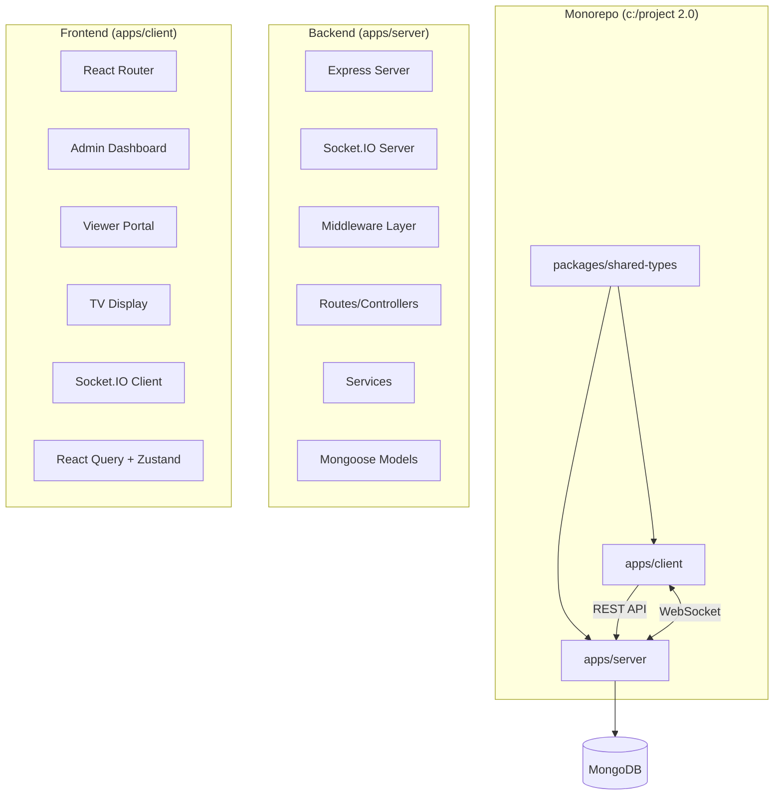

# Real-Time Room Scheduling and Live Display System

A production-grade web application enabling authorized users to schedule events in rooms/classrooms with real-time conflict detection, live TV displays, and role-based access. Built as a monorepo with shared TypeScript types.

## User Review Required

> [!IMPORTANT]
> **Tailwind CSS**: You specified Tailwind CSS — I'll use **Tailwind CSS v4** (latest) with the Vite plugin. Please confirm this is acceptable, or specify v3.
>
> **Deployment Target**: The plan includes Docker-based deployment. Should I also include deployment configs for a specific cloud provider (e.g., Vercel, Railway, Render)?
>
> **Default Admin Seed**: I'll include a seed script that creates a default admin user (`admin@scheduler.com` / `Admin@123`). Please confirm or provide preferred credentials.
>
> **MongoDB**: The plan assumes a local MongoDB instance at `mongodb://localhost:27017/room-scheduler`. Do you have MongoDB Atlas or a different setup?

## Open Questions

> [!NOTE]
> - **Time Zone**: Should the app handle multiple time zones, or assume a single fixed timezone (e.g., IST)?
> - **Recurring Events**: Should the system support recurring schedules (daily/weekly), or only single-instance events for now?
> - **Multi-day Events**: Can events span across multiple days, or are they always within a single day?
> - **Room Images**: Should rooms support image uploads?

---

## Architecture Overview



### Monorepo Structure

```
c:/project 2.0/
├── package.json                    # Root workspace config
├── tsconfig.base.json              # Base TypeScript config
├── .env.example                    # Environment template
├── docker-compose.yml              # Dev/prod containers
├── README.md                       # Project documentation
│
├── packages/
│   └── shared-types/               # Shared TS interfaces & Zod schemas
│       ├── package.json
│       ├── tsconfig.json
│       └── src/
│           ├── index.ts
│           ├── user.ts
│           ├── room.ts
│           ├── schedule.ts
│           ├── audit.ts
│           ├── api.ts              # API request/response types
│           └── socket-events.ts    # Socket.IO event type map
│
├── apps/
│   ├── server/                     # Express + Socket.IO backend
│   │   ├── package.json
│   │   ├── tsconfig.json
│   │   └── src/
│   │       ├── index.ts            # Entry point
│   │       ├── app.ts              # Express app setup
│   │       ├── socket.ts           # Socket.IO setup
│   │       ├── config/
│   │       │   ├── db.ts           # MongoDB connection
│   │       │   ├── env.ts          # Environment variables (Zod validated)
│   │       │   └── cors.ts         # CORS config
│   │       ├── models/
│   │       │   ├── User.ts
│   │       │   ├── Room.ts
│   │       │   ├── Schedule.ts
│   │       │   └── AuditLog.ts
│   │       ├── routes/
│   │       │   ├── auth.routes.ts
│   │       │   ├── user.routes.ts
│   │       │   ├── room.routes.ts
│   │       │   ├── schedule.routes.ts
│   │       │   └── audit.routes.ts
│   │       ├── controllers/
│   │       │   ├── auth.controller.ts
│   │       │   ├── user.controller.ts
│   │       │   ├── room.controller.ts
│   │       │   ├── schedule.controller.ts
│   │       │   └── audit.controller.ts
│   │       ├── services/
│   │       │   ├── auth.service.ts
│   │       │   ├── room.service.ts
│   │       │   ├── schedule.service.ts
│   │       │   └── audit.service.ts
│   │       ├── middleware/
│   │       │   ├── auth.middleware.ts
│   │       │   ├── validate.middleware.ts
│   │       │   └── error.middleware.ts
│   │       ├── validators/
│   │       │   ├── auth.validator.ts
│   │       │   ├── room.validator.ts
│   │       │   └── schedule.validator.ts
│   │       ├── utils/
│   │       │   ├── conflict.ts     # Conflict detection logic
│   │       │   ├── status.ts       # Schedule status calculator
│   │       │   └── seed.ts         # DB seed script
│   │       └── types/
│   │           └── express.d.ts    # Express augmentation
│   │
│   └── client/                     # React + Vite frontend
│       ├── package.json
│       ├── tsconfig.json
│       ├── vite.config.ts
│       ├── index.html
│       ├── public/
│       └── src/
│           ├── main.tsx
│           ├── App.tsx
│           ├── index.css           # Tailwind + global styles
│           ├── lib/
│           │   ├── api.ts          # Axios instance
│           │   ├── socket.ts       # Socket.IO client
│           │   └── utils.ts        # Helpers (date formatting, etc.)
│           ├── hooks/
│           │   ├── useSocket.ts
│           │   ├── useAuth.ts
│           │   ├── useSchedules.ts
│           │   └── useRooms.ts
│           ├── stores/
│           │   └── authStore.ts    # Zustand auth store
│           ├── providers/
│           │   ├── SocketProvider.tsx
│           │   └── ThemeProvider.tsx
│           ├── components/
│           │   ├── layout/
│           │   │   ├── AdminLayout.tsx
│           │   │   ├── ViewerLayout.tsx
│           │   │   ├── Sidebar.tsx
│           │   │   ├── Header.tsx
│           │   │   └── ThemeToggle.tsx
│           │   ├── ui/
│           │   │   ├── Button.tsx
│           │   │   ├── Input.tsx
│           │   │   ├── Select.tsx
│           │   │   ├── Modal.tsx
│           │   │   ├── Card.tsx
│           │   │   ├── Badge.tsx
│           │   │   ├── DataTable.tsx
│           │   │   ├── Pagination.tsx
│           │   │   ├── SearchBar.tsx
│           │   │   ├── LoadingSpinner.tsx
│           │   │   └── Toast.tsx
│           │   ├── dashboard/
│           │   │   ├── StatsCards.tsx
│           │   │   ├── OngoingEvents.tsx
│           │   │   ├── UpcomingEvents.tsx
│           │   │   └── RecentActivity.tsx
│           │   ├── schedules/
│           │   │   ├── ScheduleForm.tsx
│           │   │   ├── ScheduleTable.tsx
│           │   │   ├── ScheduleCard.tsx
│           │   │   ├── ConflictAlert.tsx
│           │   │   └── ScheduleFilters.tsx
│           │   ├── rooms/
│           │   │   ├── RoomForm.tsx
│           │   │   ├── RoomTable.tsx
│           │   │   └── RoomCard.tsx
│           │   └── tv/
│           │       ├── TVClock.tsx
│           │       ├── TVEventCard.tsx
│           │       └── TVRoomStatus.tsx
│           ├── pages/
│           │   ├── admin/
│           │   │   ├── Dashboard.tsx
│           │   │   ├── Schedules.tsx
│           │   │   ├── Rooms.tsx
│           │   │   ├── AuditLogs.tsx
│           │   │   └── Login.tsx
│           │   ├── viewer/
│           │   │   └── ViewerHome.tsx
│           │   └── tv/
│           │       └── TVDisplay.tsx
│           └── routes/
│               └── index.tsx       # React Router config
```

---

## Proposed Changes

### Phase 1: Monorepo Foundation & Configuration

#### [NEW] [package.json](file:///c:/project%202.0/package.json)
Root workspace configuration using npm workspaces. Defines scripts for dev, build, and seed operations across all packages.

#### [NEW] [tsconfig.base.json](file:///c:/project%202.0/tsconfig.base.json)
Base TypeScript configuration with strict mode, ES2022 target, path aliases, and project references.

#### [NEW] [.env.example](file:///c:/project%202.0/.env.example)
```env
# Server
PORT=5000
NODE_ENV=development
MONGODB_URI=mongodb://localhost:27017/room-scheduler
JWT_SECRET=your-secret-key-here
JWT_EXPIRES_IN=7d
CORS_ORIGIN=http://localhost:5173

# Client
VITE_API_URL=http://localhost:5000/api
VITE_SOCKET_URL=http://localhost:5000
```

#### [NEW] [docker-compose.yml](file:///c:/project%202.0/docker-compose.yml)
Docker Compose with MongoDB, server, and client services.

#### [NEW] [README.md](file:///c:/project%202.0/README.md)
Project documentation with setup instructions, architecture overview, API reference, and deployment guide.

---

### Phase 2: Shared Types Package

#### [NEW] [packages/shared-types/src/user.ts](file:///c:/project%202.0/packages/shared-types/src/user.ts)
Zod schemas and TypeScript types for User entity:
- `UserRole` enum: `admin`, `scheduler`
- `UserSchema` with `id`, `name`, `email`, `phone`, `department`, `role`
- `CreateUserSchema`, `LoginSchema`
- Exported inferred types

#### [NEW] [packages/shared-types/src/room.ts](file:///c:/project%202.0/packages/shared-types/src/room.ts)
Zod schemas for Room entity:
- `RoomSchema` with `id`, `roomNumber`, `building`, `capacity`
- `CreateRoomSchema`, `UpdateRoomSchema`

#### [NEW] [packages/shared-types/src/schedule.ts](file:///c:/project%202.0/packages/shared-types/src/schedule.ts)
Zod schemas for Schedule entity:
- `EventType` enum: `Lecture`, `Meeting`, `Training`, `Seminar`
- `ScheduleStatus` enum: `upcoming`, `ongoing`, `completed`
- `ScheduleSchema` with all fields including audit fields
- `CreateScheduleSchema`, `UpdateScheduleSchema`
- `ConflictDetailSchema` — shape of conflict response data

#### [NEW] [packages/shared-types/src/audit.ts](file:///c:/project%202.0/packages/shared-types/src/audit.ts)
Zod schemas for AuditLog entity:
- `AuditAction` enum: `CREATE`, `UPDATE`, `DELETE`
- `AuditLogSchema`

#### [NEW] [packages/shared-types/src/api.ts](file:///c:/project%202.0/packages/shared-types/src/api.ts)
Generic API response types:
- `ApiResponse<T>` — standardized `{ success, data, message }`
- `PaginatedResponse<T>` — `{ data, total, page, limit }`
- `ErrorResponse` — `{ success: false, message, errors? }`
- `ConflictResponse` — `{ success: false, conflict: ConflictDetail }`

#### [NEW] [packages/shared-types/src/socket-events.ts](file:///c:/project%202.0/packages/shared-types/src/socket-events.ts)
Typed Socket.IO event maps:
```typescript
interface ServerToClientEvents {
  'schedule:created': (schedule: Schedule) => void;
  'schedule:updated': (schedule: Schedule) => void;
  'schedule:deleted': (id: string) => void;
  'room:created': (room: Room) => void;
  'room:updated': (room: Room) => void;
  'room:deleted': (id: string) => void;
}

interface ClientToServerEvents {
  'join:viewer': () => void;
  'join:tv': () => void;
}
```

---

### Phase 3: Backend — Models & Database

#### [NEW] [apps/server/src/models/User.ts](file:///c:/project%202.0/apps/server/src/models/User.ts)
Mongoose schema with:
- Fields: `name`, `email` (unique, indexed), `phone`, `department`, `role`, `passwordHash`
- Pre-save hook for password hashing with bcrypt (12 rounds)
- Instance method: `comparePassword(candidate: string): Promise<boolean>`
- Indexes: `{ email: 1 }`

#### [NEW] [apps/server/src/models/Room.ts](file:///c:/project%202.0/apps/server/src/models/Room.ts)
Mongoose schema with:
- Fields: `roomNumber` (unique), `building`, `capacity`
- Compound index: `{ roomNumber: 1, building: 1 }`

#### [NEW] [apps/server/src/models/Schedule.ts](file:///c:/project%202.0/apps/server/src/models/Schedule.ts)
Mongoose schema with:
- Fields: `title`, `type`, `faculty`, `roomId` (ref: Room), `date`, `startTime`, `endTime`, `description`, `createdBy` (ref: User), `updatedBy` (ref: User)
- Timestamps: `createdAt`, `updatedAt` (Mongoose auto)
- Indexes: `{ roomId: 1, date: 1 }`, `{ date: 1, startTime: 1, endTime: 1 }`
- Virtual: `status` computed from current time vs start/end

#### [NEW] [apps/server/src/models/AuditLog.ts](file:///c:/project%202.0/apps/server/src/models/AuditLog.ts)
Mongoose schema with:
- Fields: `action`, `performedBy` (ref: User), `scheduleId` (ref: Schedule), `details` (Mixed), `timestamp` (default: now)
- Index: `{ timestamp: -1 }`

---

### Phase 4: Backend — Services & Conflict Detection

#### [NEW] [apps/server/src/services/schedule.service.ts](file:///c:/project%202.0/apps/server/src/services/schedule.service.ts)
Core business logic:
- `createSchedule(data, userId)` — validates, checks conflicts, creates, logs audit, broadcasts via Socket.IO
- `updateSchedule(id, data, userId)` — validates, checks conflicts (excluding self), updates, logs audit, broadcasts
- `deleteSchedule(id, userId)` — deletes, logs audit, broadcasts
- `getSchedules(filters, pagination)` — with population, sorting, pagination
- `getSchedulesByRoom(roomId, date)` — for room availability view
- `getTodayStats()` — total, ongoing, upcoming counts

#### [NEW] [apps/server/src/utils/conflict.ts](file:///c:/project%202.0/apps/server/src/utils/conflict.ts)
Conflict detection algorithm:
```typescript
async function checkConflict(
  roomId: string,
  date: string,
  startTime: string,
  endTime: string,
  excludeScheduleId?: string
): Promise<ConflictDetail | null> {
  // Query: same room, same date, overlapping time
  // Overlap condition: existing.startTime < newEndTime AND existing.endTime > newStartTime
  // If conflict found, return full details including creator info
  // If no conflict, return null
}
```

#### [NEW] [apps/server/src/utils/status.ts](file:///c:/project%202.0/apps/server/src/utils/status.ts)
Status calculator:
```typescript
function getScheduleStatus(date: string, startTime: string, endTime: string): ScheduleStatus {
  const now = new Date();
  const eventStart = combineDateAndTime(date, startTime);
  const eventEnd = combineDateAndTime(date, endTime);
  
  if (now < eventStart) return 'upcoming';
  if (now >= eventStart && now <= eventEnd) return 'ongoing';
  return 'completed';
}
```

#### [NEW] [apps/server/src/services/auth.service.ts](file:///c:/project%202.0/apps/server/src/services/auth.service.ts)
- `login(email, password)` — validates credentials, returns JWT
- `generateToken(userId, role)` — creates JWT with user payload
- JWT payload: `{ userId, role, email }`

#### [NEW] [apps/server/src/services/room.service.ts](file:///c:/project%202.0/apps/server/src/services/room.service.ts)
- CRUD operations with validation
- Check for associated schedules before deletion (soft-block or cascade warning)
- Broadcast changes via Socket.IO

#### [NEW] [apps/server/src/services/audit.service.ts](file:///c:/project%202.0/apps/server/src/services/audit.service.ts)
- `logAction(action, userId, scheduleId, details?)` — creates audit entry
- `getAuditLogs(filters, pagination)` — paginated with population

---

### Phase 5: Backend — Routes, Controllers, Middleware

#### [NEW] [apps/server/src/middleware/auth.middleware.ts](file:///c:/project%202.0/apps/server/src/middleware/auth.middleware.ts)
- `authenticate` — extracts and verifies JWT from `Authorization: Bearer <token>`
- `authorize(...roles)` — checks if user role is in allowed roles
- Augments `req.user` with decoded token payload

#### [NEW] [apps/server/src/middleware/validate.middleware.ts](file:///c:/project%202.0/apps/server/src/middleware/validate.middleware.ts)
- Generic Zod validation middleware: `validate(schema)` — validates `req.body` against a Zod schema
- Returns 400 with detailed field-level errors on failure

#### [NEW] [apps/server/src/middleware/error.middleware.ts](file:///c:/project%202.0/apps/server/src/middleware/error.middleware.ts)
- Global error handler with structured JSON responses
- Handles `ZodError`, `MongoServerError` (duplicate key), `JsonWebTokenError`, and generic errors
- Different detail levels for development vs production

#### REST API Endpoints:

| Method | Endpoint | Auth | Description |
|--------|----------|------|-------------|
| `POST` | `/api/auth/login` | No | Login, returns JWT |
| `GET` | `/api/auth/me` | Yes | Get current user |
| `GET` | `/api/users` | Admin | List all users |
| `POST` | `/api/users` | Admin | Create user |
| `GET` | `/api/rooms` | No | List all rooms |
| `POST` | `/api/rooms` | Admin | Create room |
| `PUT` | `/api/rooms/:id` | Admin | Update room |
| `DELETE` | `/api/rooms/:id` | Admin | Delete room |
| `GET` | `/api/schedules` | No | List schedules (filtered) |
| `GET` | `/api/schedules/today` | No | Today's schedules |
| `GET` | `/api/schedules/stats` | Admin | Dashboard stats |
| `POST` | `/api/schedules` | Admin | Create schedule |
| `PUT` | `/api/schedules/:id` | Admin | Update schedule |
| `DELETE` | `/api/schedules/:id` | Admin | Delete schedule |
| `GET` | `/api/schedules/room/:roomId` | No | Room availability |
| `GET` | `/api/audit-logs` | Admin | Paginated audit logs |

#### [NEW] [apps/server/src/socket.ts](file:///c:/project%202.0/apps/server/src/socket.ts)
Socket.IO server setup:
- Attach to HTTP server with CORS config
- Handle connection/disconnection
- Room-based broadcasting: `join:viewer`, `join:tv`
- Export `emitScheduleChange(event, data)` helper for services to use
- No auth required for viewers/TV connections (read-only broadcast)

---

### Phase 6: Frontend — Foundation & Design System

#### [NEW] [apps/client/src/index.css](file:///c:/project%202.0/apps/client/src/index.css)
Tailwind CSS foundation with:
- Custom color palette (indigo/violet primary, slate neutrals, semantic colors)
- CSS custom properties for dark/light mode tokens
- Global typography using Inter font
- Custom scrollbar styling
- Animation keyframes (fadeIn, slideUp, pulse-glow)
- Glass-morphism utility classes

#### [NEW] [apps/client/src/stores/authStore.ts](file:///c:/project%202.0/apps/client/src/stores/authStore.ts)
Zustand store for authentication:
- State: `user`, `token`, `isAuthenticated`
- Actions: `login()`, `logout()`, `setUser()`
- Persist to `localStorage`

#### [NEW] [apps/client/src/lib/api.ts](file:///c:/project%202.0/apps/client/src/lib/api.ts)
Axios instance with:
- Base URL from env
- Request interceptor: attach JWT token
- Response interceptor: handle 401 (auto-logout)

#### [NEW] [apps/client/src/lib/socket.ts](file:///c:/project%202.0/apps/client/src/lib/socket.ts)
Socket.IO client singleton with typed events from shared-types.

#### [NEW] [apps/client/src/providers/ThemeProvider.tsx](file:///c:/project%202.0/apps/client/src/providers/ThemeProvider.tsx)
Dark/light mode provider using `localStorage` and system preference detection. Applies `dark` class to `<html>`.

#### [NEW] [apps/client/src/providers/SocketProvider.tsx](file:///c:/project%202.0/apps/client/src/providers/SocketProvider.tsx)
Socket.IO connection lifecycle management:
- Connects on mount, disconnects on unmount
- Provides socket instance via React Context
- Handles reconnection with exponential backoff

---

### Phase 7: Frontend — UI Components

All components built with Tailwind CSS, dark mode support, and micro-animations.

#### UI Primitives (`components/ui/`)
| Component | Description |
|-----------|-------------|
| `Button` | Variants: primary, secondary, danger, ghost. Sizes: sm, md, lg. Loading state with spinner. |
| `Input` | Floating label, error state, icon support. |
| `Select` | Custom styled select with options. |
| `Modal` | Animated overlay with backdrop blur, header/body/footer slots. |
| `Card` | Glass-morphism card with hover lift effect. |
| `Badge` | Status badges: ongoing (green pulse), upcoming (blue), completed (gray). |
| `DataTable` | Sortable columns, row hover effects, empty state. |
| `Pagination` | Page navigation with page size selector. |
| `SearchBar` | Debounced search with icon. |
| `LoadingSpinner` | Animated spinner with optional text. |
| `Toast` | Auto-dismissing notification toasts (success, error, warning, info). |

---

### Phase 8: Frontend — Pages & Features

#### Admin Login (`pages/admin/Login.tsx`)
- Centered card with gradient background
- Email + password form with Zod validation
- Error display for invalid credentials
- Redirects to dashboard on success

#### Admin Dashboard (`pages/admin/Dashboard.tsx`)
- **Stats Cards**: Total rooms, today's schedules, ongoing events, upcoming events — with animated counters and gradient backgrounds
- **Ongoing Events**: Live-updating list with pulsing green indicators
- **Upcoming Events**: Next 5 events with countdown timers
- **Recent Activity**: Latest audit log entries with action badges

#### Admin Schedules (`pages/admin/Schedules.tsx`)
- Data table with all schedules
- Search bar (title, faculty, room)
- Filters: date range, event type, room, status
- Create/Edit via modal with `ScheduleForm`
- Delete with confirmation modal
- **Conflict Alert**: On form submission, if conflict detected, shows detailed conflict modal with existing booking info (title, time, creator, contact)
- Pagination

#### Admin Rooms (`pages/admin/Rooms.tsx`)
- Room cards grid + table toggle view
- Create/Edit modal
- Delete with dependency check
- Shows current occupancy status per room

#### Admin Audit Logs (`pages/admin/AuditLogs.tsx`)
- Chronological table with action, user, schedule, timestamp
- Filter by action type and date range
- Pagination

#### Viewer Home (`pages/viewer/ViewerHome.tsx`)
- Public page, no login required
- Shows all schedules grouped by date
- Status badges (ongoing = green pulse, upcoming = blue, completed = gray)
- Search and filter toolbar
- **Does NOT display**: creator name, creator contact, audit info
- Real-time updates via Socket.IO (new/changed events animate in)

#### TV Display (`pages/tv/TVDisplay.tsx`)
- **Full-screen optimized** layout with no navigation chrome
- **Live Clock**: Large digital clock, updates every second
- **Current Events Panel**: Active events with room info, faculty, remaining time progress bar
- **Upcoming Events Panel**: Scrolling list of next events
- **Room Status Grid**: Color-coded room availability (green = free, red = occupied)
- Auto-refresh via Socket.IO
- Large, high-contrast typography for TV readability
- URL: `/tv` — accessible without login
- Auto-hides cursor after 3 seconds of inactivity

---

### Phase 9: Frontend — Routing & Integration

#### [NEW] [apps/client/src/routes/index.tsx](file:///c:/project%202.0/apps/client/src/routes/index.tsx)
React Router v7 configuration:

```
/                     → Viewer Home (public)
/login                → Admin Login
/admin                → Admin Dashboard (protected)
/admin/schedules      → Schedule Management (protected)
/admin/rooms          → Room Management (protected)
/admin/audit-logs     → Audit Logs (protected)
/tv                   → TV Display (public, fullscreen)
```

Protected routes redirect to `/login` if not authenticated.

#### React Query Integration
- `useSchedules(filters)` — fetches schedules with real-time invalidation on Socket.IO events
- `useRooms()` — fetches rooms list
- `useDashboardStats()` — fetches dashboard statistics
- `useAuditLogs(filters)` — fetches audit logs
- Mutations for create/update/delete with optimistic updates and conflict error handling

---

### Phase 10: Deployment & Documentation

#### [NEW] [docker-compose.yml](file:///c:/project%202.0/docker-compose.yml)
```yaml
services:
  mongodb:
    image: mongo:7
    ports: ["27017:27017"]
    volumes: [mongo-data:/data/db]
  
  server:
    build: ./apps/server
    ports: ["5000:5000"]
    depends_on: [mongodb]
    environment:
      - MONGODB_URI=mongodb://mongodb:27017/room-scheduler
  
  client:
    build: ./apps/client
    ports: ["5173:80"]
    depends_on: [server]
```

#### [NEW] [apps/server/Dockerfile](file:///c:/project%202.0/apps/server/Dockerfile)
Multi-stage build: install → build → production runtime.

#### [NEW] [apps/client/Dockerfile](file:///c:/project%202.0/apps/client/Dockerfile)
Multi-stage build: install → build → nginx serve.

#### [NEW] [README.md](file:///c:/project%202.0/README.md)
Complete documentation:
- Project overview and architecture diagram
- Prerequisites (Node.js 20+, MongoDB 7+)
- Quick start guide
- Environment configuration reference
- API documentation with examples
- Socket.IO event reference
- Deployment guide (Docker + manual)
- Default credentials
- Contributing guidelines

---

## Verification Plan

### Automated Tests
```bash
# From project root — build all packages
npm run build

# Seed database with test data
npm run seed --workspace=apps/server

# Start development servers
npm run dev
```

### Manual Verification
1. **Auth Flow**: Login with seeded admin credentials → verify JWT storage → verify protected routes redirect
2. **Room CRUD**: Create, edit, delete rooms → verify real-time updates on viewer page
3. **Schedule CRUD**: Create schedule → verify conflict detection → verify real-time broadcast
4. **Conflict Detection**: Book overlapping time in same room → verify rejection with detailed conflict info
5. **Viewer Portal**: Open `/` in incognito → verify no creator info visible → verify search/filter
6. **TV Display**: Open `/tv` → verify full-screen layout → verify auto-update on schedule changes
7. **Dark Mode**: Toggle theme → verify all pages render correctly
8. **Mobile**: Test responsive layout on mobile viewport
9. **Real-Time**: Open admin + viewer + TV in separate tabs → create schedule → verify all update simultaneously
